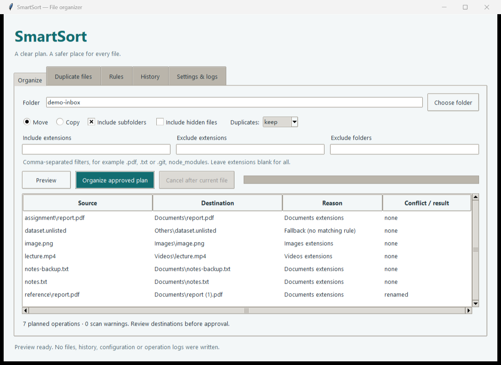
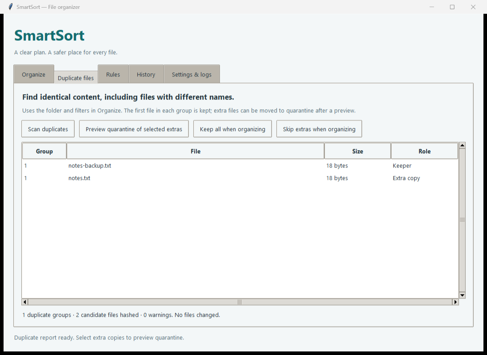
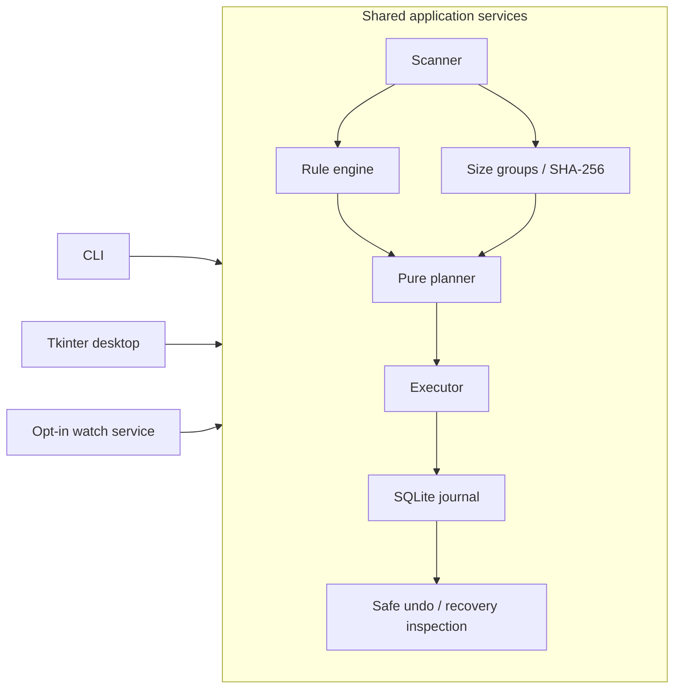

# SmartSort

A Python file organizer with validated rules, safe previews, duplicate reports, persistent undo, a command line interface, and a Tkinter desktop application.

## Overview

SmartSort separates deciding what to do from changing files. Preview produces a complete operation plan with reserved destination names. Execution rechecks each file, records durable progress in SQLite, and reports successes, failures, skipped files, and items that need a fresh preview.

SmartSort is an extended and substantially modified version of [Shunlauk/file-organizer-python](https://github.com/Shunlauk/file-organizer-python), based on audited upstream commit `64faf6652918fc5f01b830849f7b88c43e43d944`. The upstream Git history, attribution, and MIT license are preserved.

The application is designed for Windows, macOS, and Linux. Local execution and desktop checks were performed on Windows with Python 3.14.7; other operating systems and Python versions are not claimed as locally verified.

## Features

### Inherited / upstream foundation

- Extension-based organization and useful category mappings.
- Move and copy workflows.
- Preview, filename conflict handling, logging, and the idea of undo.
- SHA-256 content comparison as a foundation for duplicate detection.

### Major functionality added in SmartSort

- Import-safe modules shared by the CLI and desktop application.
- A scanner that prunes excluded, hidden, internal, and destination directories before descending.
- Versioned JSON rules for extension, filename glob, size, modified date, and available creation date.
- A pure planner that reserves names across the entire batch.
- Per-file execution results with source and destination revalidation and cancellation between files.
- A SQLite intent journal, several previous sessions, conflict-safe undo, and read-only interrupted-session inspection.
- Collection-wide duplicate detection with size grouping and SHA-256, including differently named files.
- A working desktop interface for organization, duplicates, rules, history, monitoring, logs, and statistics.
- Explicitly enabled monitoring with a stability window and temporary download exclusions.
- Statistics derived from successful journal records and actual duplicate report observations.
- Disposable-folder regression tests for upstream defects and the replacement behavior.

## Screenshots

Actual desktop views:





## Architecture

Both interfaces call the same core services:



The scanner discovers eligible files; rules choose their categories; the planner reserves destinations; the executor applies an approved plan. The journal records intent and progress so successful earlier operations survive a later failure. The duplicate detector reports content groups without deleting files. The CLI, GUI, and watch service reuse these modules.

See [the architecture document](docs/ARCHITECTURE.md) for the journal ordering, thread model, and safety boundaries.

## Installation

Requires **Python 3.11 or newer**. The organizer core uses the Python standard library. The GUI requires Tkinter; some operating-system Python packages install Tk support separately.

Create an isolated environment in the cloned repository:

```text
python -m venv .venv
```

Activate it in PowerShell:

```powershell
.venv\Scripts\Activate.ps1
```

Or in a macOS/Linux shell:

```sh
source .venv/bin/activate
```

Install the application:

```text
python -m pip install -e .
```

For tests and optional folder monitoring:

```text
python -m pip install -e ".[dev,watch]"
```

`pytest` is a development dependency. `watchdog` is required only for watch mode. No third-party dependency is required by the organizer core.

## CLI Usage

Start with a new disposable directory. This setup fails if `demo-files` already exists, rather than overwriting its contents:

```text
python -c "from pathlib import Path; p=Path('demo-files'); p.mkdir(); (p/'notes.txt').write_text('Example notes', encoding='utf-8'); (p/'same-content.md').write_text('Example notes', encoding='utf-8')"
smartsort preview demo-files --state-dir demo-state
smartsort organize demo-files --copy --yes --state-dir demo-state
smartsort duplicates demo-files --state-dir demo-state
smartsort history --state-dir demo-state
smartsort stats --state-dir demo-state
```

`python -m smartsort` provides the same commands when using the installed package without its console shortcut.

Useful options:

```text
smartsort preview demo-files --recursive --include-hidden
smartsort preview demo-files --exclude-dir .git --exclude-dir node_modules
smartsort preview demo-files --include-ext .pdf,.txt --exclude-ext .tmp
smartsort preview demo-files --config rules.json --json
smartsort organize demo-files --move --duplicates skip --yes
smartsort history SESSION_ID
smartsort undo SESSION_ID --yes
smartsort recover SESSION_ID
smartsort --help
smartsort organize --help
```

Replace `SESSION_ID` with an ID returned by `history`. Use the same `--state-dir` for related commands. Without that option, runtime state uses the platform's application-data directory; `SMARTSORT_DATA_DIR` can override it. Merely querying that location does not create it.

History/log storage must differ from the selected organization root. A separate sibling directory, as in `demo-state`, keeps runtime state clear of the files being organized; a configured nested state folder is excluded from scanning.

Organization and undo ask for approval in an interactive terminal. Automation must supply `--yes`; unknown extensions use the configured fallback without prompting. Destination files are not overwritten.

Exit codes are `0` for a successful workflow, including a declined approval; `1` for a configuration, prerequisite, or unrecoverable command error; and `2` for scan warnings, partial execution, conflicts, or unresolved items. Argument parsing also uses `2` for invalid command syntax.

For automated `preview`, `organize --yes`, `duplicates`, and `undo --yes` workflows, `--json` emits one plan, report, or result JSON document per completed command. An organization result includes each item's planned operation and outcome. `history`, `stats`, and `recover` already print JSON. Use `--yes` for unattended mutations so an approval prompt cannot interfere with machine-readable output.

## GUI Usage

Launch with any of these equivalent entry points:

```text
smartsort gui
smartsort-gui
python -m smartsort.gui.app
```

To select custom rules and storage:

```text
smartsort gui --config rules.json --state-dir demo-state
```

The five desktop areas are:

- **Organize:** choose a folder, move/copy mode, recursion, hidden-file behavior, and filters. Select Preview, review the table, then explicitly approve the displayed plan. Input changes invalidate it. Cancel stops before the next file after the current operation finishes.
- **Duplicate files:** scan the chosen folder, choose keep/skip behavior for organization, or select extra copies and preview their quarantine. Keeper files are retained.
- **Rules:** load, edit, validate, apply, and save JSON. Edits become active only after Apply or Save.
- **History:** refresh sessions, inspect details, undo eligible files, or inspect interrupted-session recovery recommendations.
- **Settings & logs:** select state storage, view real history statistics and operation logs, and explicitly start or stop monitoring.

Scanning, hashing, file operations, and watch startup run in workers. Results arrive through a queue; Tkinter updates remain on the UI thread. Large preview and duplicate tables are rendered in short batches. Desktop startup does not create runtime state or enable monitoring.

## Rules

Create and validate the default configuration:

```text
smartsort rules init rules.json
smartsort rules validate --config rules.json
```

A valid version-1 example:

```json
{
  "version": 1,
  "fallback": "Others",
  "duplicates_folder": "Duplicates",
  "rules": [
    {
      "name": "Course reports",
      "extensions": [".pdf", ".docx"],
      "pattern": "course-*",
      "destination": "Study/Reports"
    },
    {
      "name": "Large videos",
      "extensions": [".mp4", ".mkv"],
      "min_size": 104857600,
      "destination": "Media/Large videos"
    },
    {
      "name": "Older notes",
      "extensions": [".txt", ".md"],
      "modified_older_than_days": 90,
      "destination": "Study/Older notes"
    },
    {
      "name": "Recent images when creation time is available",
      "extensions": [".jpg", ".png"],
      "created_after": "2026-01-01T00:00:00Z",
      "destination": "Media/Recent images"
    }
  ]
}
```

Rules are evaluated in order; **the first matching rule wins**. All predicates specified in one rule must match. Extension matching is case-insensitive and supports compound suffixes such as `.tar.gz`. Filename globs are case-sensitive and apply to the filename, not a directory path. `min_size` and `max_size` include their boundary values and use bytes.

Supported date predicates are `modified_before`, `modified_after`, `modified_older_than_days`, and their `created_` equivalents. Before/after and age comparisons are exclusive. Dates accept ISO-8601 strings; a date or datetime without a timezone is interpreted as UTC. Creation predicates do not match when a reliable creation timestamp is unavailable; Unix metadata-change time is not treated as creation time.

Destinations must be portable relative paths using forward slashes. Absolute paths, drive paths, `..`, empty/dot components, reserved internal directories, and invalid portable names are rejected. Existing symlink or junction components are also rejected. Nested categories such as `Study/Reports` are supported and created only during execution.

Legacy upstream extension-to-category JSON mappings remain loadable. Saving them produces a validated version-1 document. Packaged default mappings are never rewritten to learn unknown extensions.

## Safe Preview

Preview reads eligible files and produces an immutable plan. It does **not** move/copy files, create destination directories, modify rules, create history or locks, or configure operation logging.

The planner reserves destination names across the entire batch, including case-insensitive collisions for portable behavior:

```text
first/report.pdf  → Documents/report.pdf
second/report.pdf → Documents/report (1).pdf
```

Execution consumes that plan and checks source identity and destination conditions again. If another program changes a file's recorded metadata or creates a destination after preview, the affected item needs a new plan. Execution does not silently invent a different destination.

Ordinary preview records metadata identity rather than hashing every file. It cannot detect every content alteration that preserves that identity and metadata. Execution records content fingerprints before transfer; duplicate-aware plans also retain the hashes already calculated during duplicate comparison.

The desktop retains exactly the previewed plan until approval. The CLI `organize` command builds and displays its own plan immediately before approval; a separate earlier `preview` invocation is informational rather than a saved executable plan.

Recursive scans prune configured destinations, SmartSort state, internal directories such as `.git` and `.venv`, and user exclusions. Symlinks, Windows junctions/reparse points, and non-regular files are skipped. Hidden detection covers leading-dot names and Windows hidden/system attributes where exposed by Python. Active configuration and journal files are excluded by the application workflows.

## Duplicate Detection

Duplicate detection groups by file size first, hashes only size groups containing multiple candidate files, and uses SHA-256 for final content grouping. Different filenames can belong to the same group. Unreadable or changed candidates produce warnings rather than silently disappearing from the report.

```text
smartsort duplicates demo-files --recursive --state-dir demo-state
smartsort organize demo-files --duplicates skip --yes --state-dir demo-state
smartsort duplicates demo-files --action quarantine --yes --state-dir demo-state
```

Keep leaves all files eligible for ordinary organization. Skip retains the first deterministic member and skips extras during organization. Quarantine moves extra members into the configured `duplicates_folder`; it displays a plan and requires approval. There is no duplicate deletion command or automatic deletion.

Quarantine requires move mode; `organize --copy --duplicates quarantine` is rejected. The dedicated `duplicates --action quarantine` workflow always plans moves. Selected extras are rechecked before preview, and the computed SHA-256 is retained for execution revalidation. A changed selection requires a fresh duplicate scan.

An explicit duplicate report records the observed group count in SQLite for statistics, even when no files are changed. The duplicate detector itself is read-only. Repeated reports contribute cumulative observations; the statistic is not a count of unique duplicate groups currently on disk.

## Undo and Recovery

Each execution uses a new journal session. History records the root, mode, timestamps, per-item status, errors, and file identity information. Successful earlier files remain recorded when an ordinary later file fails. A journal persistence failure stops further file changes and preserves uncertain artifacts for inspection.

Move undo verifies the organized destination and refuses to restore into an occupied original path. Copy undo verifies the copied destination before removing it. Changed, replaced, missing, or unverifiable files become conflicts; undo does not blindly overwrite or delete them.

```text
smartsort history --state-dir demo-state
smartsort history SESSION_ID --state-dir demo-state
smartsort undo SESSION_ID --yes --state-dir demo-state
smartsort recover SESSION_ID --state-dir demo-state
```

`recover` is **read-only inspection**. It explains pending journal stages and any manual reconciliation needed. It does not finalize journal entries, move files, delete files, or repair a database automatically.

SQLite transactions do not make filesystem changes atomic. The journal orders durable intent, transfer identity, source removal, and completion records, but a crash or storage failure can still leave partial states. File identity checks and SHA-256 fingerprints reduce accidental data loss; they cannot eliminate adversarial races with other operating-system processes. Preserve ambiguous files and inspect recovery recommendations before acting.

Move prefers a same-filesystem hard-link transfer where supported, with an exclusive byte-copy fallback when needed. Copy and fallback transfers currently preserve content rather than original timestamps, ACLs, or all other metadata. They are not backups. Unsupported links/reparse paths are rejected rather than followed.

Statistics report cumulative successful activity, including operations subsequently undone. They do not describe the current number of organized files on disk.

## Watch Mode

Install the optional dependency and explicitly choose a folder:

```text
python -m pip install -e ".[watch]"
smartsort watch demo-files --recursive --stable-seconds 5 --poll-seconds 1 --state-dir demo-state
```

Ctrl+C stops CLI monitoring. The desktop offers explicit Start monitoring and Stop monitoring controls. No personal folder is monitored automatically, and files already present when monitoring starts are left alone.

New arrivals must keep the same size and modification timestamp for the configured stability interval. `.crdownload`, `.part`, `.tmp`, `.download`, and `.partial` files are excluded. Destination and internal events are ignored, execution is serial, and root locks prevent overlapping SmartSort mutations against the same selected folder. Ordinary file failures have bounded retries; scan failures or ambiguous journal results stop monitoring for review.

A stability interval is a practical heuristic: a writer can pause longer than the window and resume later. Monitor a controlled incoming folder and choose an interval appropriate for its producer. Watch mode does not assert that every external writer has closed its file.

## Testing

```text
python -m pip install -e ".[dev,watch]"
python -m pytest
python -m smartsort --help
python -m smartsort.gui.app --state-dir demo-state --smoke-seconds 1
```

Tests use disposable directories and cover import safety, upstream characterizations, rule validation and priority, traversal pruning, path containment, batch collisions, preview purity, partial failures, durable history, journal failures, undo conflicts, duplicate optimization, watch stabilization, CLI workflows, and real Tkinter behavior when a display is available.

The upstream snapshot tests deliberately reproduce original defects. SmartSort's other tests assert the corrected safety behavior; a passing characterization test alone is not proof that the new application is safe. See [baseline evidence](docs/BASELINE_REPORT.md) and [the development log](docs/DEVELOPMENT_LOG.md).

Display-dependent tests explicitly skip when Tk cannot open a display; privileged filesystem tests can skip when the operating system does not permit creating the required links. Such skips are reported and do not count as successful execution of those scenarios. [The configured GitHub Actions matrix](.github/workflows/tests.yml) targets Windows, macOS, and Linux with Python 3.11 and 3.14; it has not been verified by an executed hosted run.

## Project Structure

```text
smartsort/
  core/
    models.py       Typed domain records and states
    scanner.py      Pruned, deterministic discovery
    rules.py        Predicate matching and destination validation
    organizer.py    Pure planning and per-file execution
    filesystem.py   Identity checks, exclusive transfers and root locks
    history.py      SQLite journal, undo and recovery inspection
    duplicates.py   Size-first SHA-256 grouping
  config/manager.py Versioned rules and explicit persistence
  cli/main.py       Argparse workflows
  gui/app.py        Tkinter desktop and queued worker results
  services/watcher.py Optional event monitoring and stability tracking
  utils/logging_utils.py Explicit rotating operation logging
  data/extensions.json Packaged upstream-compatible mappings
tests/              Disposable regression and feature tests
docs/               Baseline, architecture, development log and screenshots
FileOrganizer.py    Compatibility launcher for SmartSort
extension.json      Original mapping, loadable explicitly with --config
pyproject.toml      Python metadata and console entry points
LICENSE             Preserved upstream MIT license
```

Runtime databases, logs, virtual environments, caches, and local runtime state belong outside committed source. The original upstream `undo.json` format is not imported as trusted SmartSort history; the original snapshot is preserved for baseline tests.

## Roadmap

- Run and review the hosted operating-system/Python validation matrix after publication.
- Improve metadata preservation for exclusive byte-copy transfers.
- Add explicit, reviewed reconciliation actions for interrupted sessions while preserving the current conservative inspection behavior.
- Improve large-directory watch indexing and desktop accessibility checks.

These are future improvements, not implemented release features.

## Acknowledgements

SmartSort extends [Shunlauk/file-organizer-python](https://github.com/Shunlauk/file-organizer-python). Its original extension mappings and organizer ideas provided the starting point. The application is an extended and substantially modified version of that project; not all source code was originally authored by the SmartSort contributor. Full upstream Git history and attribution are retained.

## License

MIT. The upstream [LICENSE](LICENSE) and its permission notice are preserved, including:

```text
Copyright (c) 2026 Love_Jangid
```
