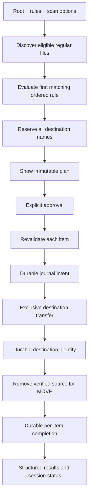

# SmartSort architecture

SmartSort is a standard-library organizer with two interfaces and an optional `watchdog` service. The implementation separates read-only decisions from approved filesystem changes. It is intended to remain understandable as a university Computer Science portfolio project.

## Interfaces and domain records

`cli/main.py` defines argparse workflows. `gui/app.py` supplies five working Tkinter areas. Both call `core` and `config` services directly; GUI event handlers do not implement a second organizer.

Frozen dataclasses describe configuration, file identity, scan results, duplicate groups, planned operations, plans, and operation results. `OperationType` and `Status` make move/copy behavior and lifecycle states explicit. History reads expose structured session dictionaries backed by SQLite.

The important flow is:

## Discovery and rules

The scanner uses directory traversal with early pruning. It supports top-level and recursive scans, hidden inclusion, extension inclusion/exclusion, user directory exclusions, destination exclusions, and explicit file exclusions. It never recursively follows directory symlinks. Symlinks, junctions/reparse points, and non-regular files are not organization candidates.

Leading-dot names and exposed Windows hidden/system attributes determine hidden behavior. An excluded or hidden parent is pruned before descent. Internal directories, the application state directory, destination categories, active configuration, and journal files are protected by the surrounding workflows. File metadata and directory traversal errors are returned as structured scan warnings.

`config/manager.py` reads packaged defaults or an explicit configuration file without learning mappings into the installation. It accepts useful legacy extension mappings and version-1 JSON. Validation rejects unknown fields, invalid types, duplicate JSON keys, unsupported versions, inconsistent bounds, and unsafe categories. Explicit saves validate first, write a temporary file in the destination directory, flush it, and replace the configuration file.

Rules are ordered: first match wins, with all predicates inside a rule combined using AND. Extensions use case-insensitive suffix matching; filename globs are case-sensitive. Size bounds are inclusive. Date and age comparisons are exclusive, and timezone-free dates use UTC. Reliable creation time is used only when available; Unix metadata-change time is never substituted for it. A rule requiring unavailable creation time does not match.

## Pure planning

`plan_organization` scans, optionally identifies duplicate members, selects categories, and returns an `OperationPlan`. It does not create directories, locks, history, configuration, or logging files.

Destinations must be relative portable categories contained inside the selected root. Validation rejects absolute and drive paths, traversal, invalid/internal names, and existing symlink/junction components. Nested categories are allowed.

Planning maintains a reservation set over the whole batch and checks existing paths. Names are compared case-insensitively for portable collision behavior. Occupied names become `name (1).ext`, `name (2).ext`, and so on. This avoids planning several source files into the same previously empty destination.

Duplicate keepers are chosen over the full eligible scan before filtering an explicitly selected subset. Only currently verified extras can enter a selected quarantine plan; stale, unique, missing, or newly designated keeper paths produce a fresh-scan warning. Group SHA-256 values are retained in planned identities so duplicate content can be revalidated during execution. Quarantine requires move mode. A duplicate skip is represented in the plan and reported as skipped during execution.

The desktop caches the exact plan shown in its table. Changing relevant inputs or applying rules invalidates it. The CLI builds and displays a plan within `organize`; a separate `preview` process does not serialize a reusable approval artifact.

## Execution and filesystem protection

`execute_plan` consumes the immutable plan and returns one structured result per item. Before changing a file it validates containment, path components, regular-file identity, and destination availability. A materially changed source or newly occupied destination requires replanning; execution does not silently change the destination from the approved plan.

Root locks combine an in-process lock and an operating-system advisory lock. They coordinate SmartSort processes working on the same selected root. They do not lock unrelated applications out of that filesystem.

The filesystem service uses exclusive destination creation. Move prefers a same-filesystem hard-link transfer where supported, falling back to a verified exclusive byte copy for unsupported or cross-filesystem transfers. Source deletion occurs after destination identity has been recorded durably. Copy creates a verified destination while preserving the source.

Source/destination identities include size, nanosecond modification time, device, inode, and content fingerprints where recorded. Transfer and undo use SHA-256 checks. Directory checks reject link and reparse components. These checks protect against ordinary changes and collisions; they do not make the application safe against every adversarial operating-system race.

An ordinary pre-action file failure becomes a failed or needs-replan result and does not erase earlier successes or automatically abort subsequent items. Cancellation is checked between items. A persistence failure or a transfer whose state is ambiguous stops further mutation; uncertain artifacts are preserved rather than deleted to hide a journal gap.

Byte-copy transfers currently preserve file content, not original timestamps, ACLs, extended attributes, or every other metadata field. A successful same-filesystem hard link shares the underlying file's metadata, but there is no general metadata-preservation guarantee for copy/fallback workflows.

Runtime storage must differ from the selected organization root. Logging validates the active file and two rotated backups, rejecting non-regular targets, links, junctions, and hard-link aliases before appending or rotating. Rotation creates its destination exclusively; changing storage closes the previous file handler. The executor and undo independently protect the history database, SQLite sidecars, and their hard-link aliases.

## SQLite journal ordering

`HistoryStore` opens connections per operation; read-only queries do not create a missing database. Write connections use foreign keys and full synchronous SQLite settings. Tables contain sessions, per-item intent/progress, and duplicate report observations.

For each executing item:

1. Persist a pending intent with source, destination, mode, reason, category, and source identity.
2. Create and verify the exclusive destination.
3. Persist the created destination identity and `destination_ready` stage.
4. For move, verify and remove the source.
5. Persist the succeeded status and application timestamp.

Undo uses its own `undo_intent` and `restore_ready` stages before completing an undone item. Per-item success is written before the end-of-session summary, so an ordinary later failure does not discard earlier durable records.

SQLite and the filesystem are different storage systems. There is no shared transaction and no claim of filesystem atomicity. Crashes between these steps can leave a copied destination, both paths, a completed move without its completion record, or an interrupted restoration. Pending stages and identities support conservative inspection of those cases.

## Undo and interrupted-session inspection

Move undo verifies the organized destination and refuses an occupied original path. It creates the restored source exclusively, persists its identity, then removes the verified organized destination. Copy undo removes a destination only when it still matches the recorded copy identity. Replaced, changed, missing, or unverifiable files are conflicts.

`recover_session` is read-only. It inspects pending stages, verifies available identities, and returns recommendations. It does not move files, delete files, update item statuses, or automatically reconcile ambiguous records. Manual review remains necessary for interrupted writes and transfers.

Upstream `undo.json` records lack SmartSort's identity/journal guarantees and are not imported as trusted new history.

## Duplicate reports and statistics

The duplicate detector groups candidates by size and hashes only groups with more than one distinct input path. It streams SHA-256 in chunks and checks candidates before, during, and after hashing. Groups are content-based, so filenames may differ. Changed or unreadable candidates yield errors.

The detector itself is pure. The explicit CLI/GUI duplicate-report workflow stores the observed group count for statistics. Keep and skip do not delete files. Quarantine creates an ordinary move plan for extra members, goes through explicit approval, and uses the same journal and undo services.

Statistics derive file and byte counts, extension/category/mode breakdowns, and session counts from real recorded activity. A successful item continues contributing to cumulative activity after undo. Duplicate group statistics sum report observations, so repeated scans of the same group increase that count; they are not a deduplicated inventory.

## Desktop concurrency and lifecycle

UI handlers read Tk variables and capture plain values before creating a worker. Workers perform discovery, hashing, filesystem operations, history queries, and watch startup. Results and progress enter a thread-safe queue. The UI drains it with `root.after`; widgets and dialogs remain on the Tk thread.

Concurrent mutation workflows are disabled while a worker or monitor is active. The UI limits queue draining per tick and renders large tables in small scheduled batches. Preview approval is enabled only when the complete current plan is available. Cancellation signals the executor to skip unstarted items.

Closing requests cancellation, stops monitoring, cancels UI scheduling, and waits without blocking the Tk event loop for the active filesystem work to finish. The current file is allowed to reach its safe boundary before the window is destroyed.

## Optional monitoring

The watch service is loaded only on explicit request and requires `watchdog`. It establishes an initial existing-file set so starting monitoring does not organize old files. New arrivals enter a serial queue and must have unchanged size/mtime over a configurable interval before a fresh plan is built.

Temporary download suffixes, internal files, and destinations are excluded. Serial execution, root locks, and ignored destination events reduce overlap and event loops. Ordinary file failures have bounded attempts; scan failures, ambiguous pending operations, or journal errors stop monitoring and surface errors for review. Stop prevents new operations and lets current work finish.

Stability is a heuristic rather than proof that a producer has closed a file. A paused writer can resume after the interval. Watch currently rescans the eligible collection when processing pending events; a future incremental index could improve very large-directory monitoring.

## Runtime and validation boundaries

Python 3.11 or newer is declared. Core services use the standard library; Tkinter supplies the desktop; `watchdog` is optional and `pytest` is for development. Runtime state is excluded from source control and lives in explicit or platform application-data storage. CLI and desktop workflows require state storage to differ from the organization root; nested state directories are excluded from discovery.

Local checks were performed on Windows/Python 3.14.7, including real Tk widgets and disposable file operations. Hosted matrices or intended macOS/Linux support are not evidence that those environments have executed the suite. Display and privilege limitations are reported as skips. The baseline fixtures separately preserve the original audited defects; release acceptance depends on the corrected SmartSort tests and actual workflow validation.
